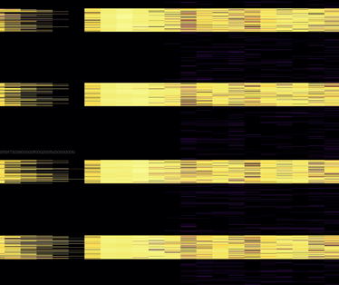

# RFC: `KeyVisualizer` 可视化热点图

## Summary

向 `PD` 内部新增默认启用的 `KeyVisualizer` 组件，提供 `TiKV` 集群可视化 Key 热点图，用于排查热点以及不合理的应用程序 pattern
`KeyVisualizer` 可通过 `PD` 的 URL 在浏览器直接使用。

## Motivation

目前 TiKV 集群发生热点时常用排查诊断工具 `pd-ctl`/`Prometheus`/`Grafana` 等。
这些工具有使用难度大，问题排查时间长，日志数据数据量庞大，不够直观，难以发现应用程序的 pattern，无法保证诊断正确性等问题。而且热点往往有聚集性和周期性，可视化方案很适合解决这些问题。

`Google BigTable` 也遇到了类似问题。为此 Google 提供了 `BigTable KeyVisualizer`  (视频介绍) 工具并推荐用户首先使用它来自我排查应用程序问题。
经过调研，Google 的工具的部分功能也适用于 `TiKV` 集群，因此会参考它的功能设计。

## Detailed Design

### 特性

`KeyVisualizer` 默认开启，定时收集集群中 `Region` 的各种统计信息，并可即时渲染最近 一小时/24小时/一周/一个月 内集群的多个热图。

#### 前端特性

热图的形式为二维颜色图表：

- X 轴：时间轴
- Y 轴：Key轴
- 颜色：热度

热图热度分为几种，由不同的热图分别提供：

- 读流量
- 读 Ops（长期计划）
- 写流量
- 写 Ops（长期计划）
- 读延迟（长期计划）
- 写延迟（长期计划）
- CPU 使用（长期计划）
- 内存使用（长期计划）
- 磁盘读写（长期计划）
- Client 连接数量（长期计划）

交互特性：

- 热图左侧显示显示当前行所属 `DB`，`Table`，`RowId` 等信息。
- 鼠标悬停显示提示框，显示鼠标下 `Region` 的 KeyId，流量详细信息等热图
- 可框选或点击 `Label` 放大指定范围
- 警告异常区域（长期计划）：
  - 流量超过阈值
  - Latency，等待时间过高

### 后端特性

- 新增 `PD` API，提供前端 Heatmap 所需要的数据接口
- 持久化数据
- 支持不同编码方式的 Key 值的 Schema 解析（默认 TiDB 编码方式）

### PD 前端实现

#### 获取数据

前端通过 API 获取后端压缩后的热点信息。

API 接口定义为：

URL：`/pd/apis/keyvisual/v1/heatmaps?`

请求参数：

- `type`: 请求查看类型:
  - `write_bytes`
  - `read_bytes`
  - `write_keys`
  - `read_keys`
- `startkey`: 热图 Key 轴的起始 Key
- `endkey`: 热图 Key 轴的结束 Key
- `starttime`: 热图 Time 轴的起始时间 (秒单位 UNIX 时间戳)
- `endtime`: 热图的 Time 轴的结束时间 (秒单位 UNIX 时间戳)

返回数据格式：

```typescript
export type KeyAxisEntry = {
  key: string
  labels: string[]
}

export type HeatmapData = {
  timeAxis: number[]
  keyAxis: KeyAxisEntry[]
  values: number[][]
}
```

#### 渲染热图

获取数据后即时在前端渲染成图表。
使用 `D3.js` 来支持时间横轴，Key 纵轴以及 Label 轴。
使用 `OffscreenCanvas` 后台渲染，每一个像素对应一个数据格，至少可一次性显示 1000 x 1000 个热点区域。

POC 实现效果：

> workload:
> sysbench oltp_update_non_index -table-size=4



### PD 后端实现

#### Region 统计信息收集

定期从 `PD Server` 获取全量 `Region` 统计信息，采集频率为一分钟。

需要解决的问题：

- Region 数量可以达到百万数量级，需要注意时间和空间消耗。
- 由于 Region 的分裂合并、TiKV 信息上报、信息采集都是异步发生的，获取到的全量信息中，Key 的范围可能存在空洞。

#### Region 统计信息压缩

##### Time 轴压缩

减少内存的开销，对于时间轴采用分层压缩的方式，这个压缩比是可以进行配置的，目前分为 3 层：

- 第一层保存近一天的数据，精度为 1 min, 即可形成 60 * 24 = 1440 个轴
- 第二层保存近一周的数据，精度为 15 min, 即可形成 7 \* 24 \* 4 = 672 个轴
- 第三层保存近一个月的数据，精度为 1h, 即可形成  30 * 24 = 720 个轴

共 2872 个轴，同时展现上去。

##### Key 轴压缩

`Region` 数量可以达到百万数量级，因此报告每个行的指标并不现实。数据需要按某些规则聚合以减少数据量，有两种策略可用（暂时采用 `Region` 热度方案）：

- 按 `Key` 数量 （Google 采用）：行数量少的 `Region` 热点信息合并取加权平均值：
  - 优点：热点图纵轴分布符合集群 Key 数量分布
  - 缺点：集中在少量 Key 上的大量读写的热点信息不明显
- 按 `Region` 热度 （Hackathon 版采用）：冷行合并取加权平均值
  - 优点：热点信息明显，无需放大即可获得细节信息
  - 缺点：无法直观看出热点区域的行数量

- 改进点一：合并时同时考虑合并热度接近的行（不允许跨边界）
- 改进点二：`TiDB` 模式下，需要考虑边界问题，合并不能越界
- 改进点三：在合并后的数量较少时，前端每行的高度可以根据 key 数量加权

- 性能问题：
`Matrix` 的转换需要一些时间，特别是 `Key` 的 Decode 和 Encode 过程
https://github.com/pingcap/pd/issues/1837

##### 内存利用优化

按现有 TiDB 的编码方式:

```text
------------------------------------------------------
t TableID _r RowID
t TableID _i IndexID IndexValues
------------------------------------------------------
```

Key 的长度大多在 20 ～ 40 byte 不等，每个 bucket 的值按现有四个纬度，目前需要 4 个多维值来算, 需要 32 byte。
每分钟若按 200w Region 的量来估算，需要内存量约为 99MB ~ 137MB

为了减少内存开销：

- Key 的存储优化: key 的常量池：

  - https://github.com/chriso/go-intern

  - https://godoc.org/github.com/chriso/go-intern

- 冷信息预删除：在添加数据前，如果该 `Region` 统计信息很小，则不予收集，涉及到计算时视为 0，可以减少存储压力。

- 0 值 `null` 优化

##### 持久化热点信息

若所有的统计信息都存储在内存中，随着 `Region` 数量的增多和时间的推移，内存资源势必是不够用的。另外，我们也希望 `PD` 重启不会丢失已有的统计信息。
因此，考虑将数据持久化到目前 `PD` 的 `leveldb` 中：

存储格式：

- key: Timestamp_StartKey
- value: TimeDelta_EndKey_Stat

其中：

- `Timestamp`: 数据上报的时间戳
- `TimeDelta`: 该统计数据的收集粒度。初始值取决于 `TiKV` 的上报间隔，压缩后则乘上压缩参数
- `StartKey`: 该统计信息 `Bucket` 所对应的 Key Range 的 Start Key
- `EndKey`: 该统计信息 `Bucket` 所对应的 Key Range 的 End Key
- `Stat`: 统计信息

##### 使用专用的存储设计来优化持久化性能（长期计划）

在存储结构上也采用分层结构，保证在顺序写入、顺序扫描、数据压缩时都有良好的性能。

参考 `Influx DB`:

https://docs.influxdata.com/influxdb/v1.3/concepts/storage_engine/#leveldb-and-log-structured-merge-trees

#### 生成热图信息

##### 根据请求实时压缩计算（目前采用）

根据前端请求的参数，扫描数据源，生成相应的热图。参数说明参见 `PD` 前端实现篇章。
相关的步骤如下：

- 根据 StartTime 和 EndTime 确定时间轴的数量和每个轴的 `[StartTime, EndTime)`
- 每个时间轴对应一个 `KeyAxis`
- Scan 数据源，每行数据转换为 `Line`，根据 `Key` 中的 `TS` 添加到对应的 `KeyAxis` 中
  - WIP: 每生成一个 `KeyAxis`，先进行一次预压缩，压缩到 `Bucket` 在 10000 以内
- 得到一个 `Plane`
- 对 `Plane` 进行统计分析，得到一个合理的 key 纵轴划分方案
- 将 `Plane` 按照划分方案像素化为一个 `Matrix`
- 给 `Matrix` 的 `Key` 纵轴添加 `Label` 信息

##### 每日每时报表模式（Bigtable 采用）

每经过固定的时间间隔，生成一张热度的报表。报表会保存较长的一段时间，可随时浏览。
其中，每天会生成前一周的 Daily Report，每小时会生成前4小时的 Hourly Report。

优点：

- 不再参与的计算的历史统计信息可以删除，节省存储资源。
- 报表生成后可反复查看，无需再次计算，节省计算资源。

缺点：

- 报表直接决定了数据精度，无法放大到更大的精度观察数据。
- 每张热度的时间区域是定死的，如果数据未生成必须等待，无法实时浏览。
- 时间跨度是固定的，无法在较大的时间跨度上分析周期热点。

#### Schema 标签解码

标签解码用于生成 Labels 轴信息以标识数据所属的区域，另外还用来限制 Key 轴压缩划分，防止合并不同的逻辑区域（比如两张表的交界处）。

默认支持两种模式：

- `TiDB` 模式
  - 定期从 `TiDB` 获取全量表信息并缓存。
  - 根据 `TiDB` 的编码方式，每张表所对应的 StartKey 和 EndKey 作为边界限制。
  - Labels 信息标记为该区间所包含的表的信息。一个区间可能对应多张表。

- 纯 TiKV 模式
  - 根据 Key 的 pattern 可自己实现边界规则和 Key 的 解析器
  - 比如常见的分隔符的方式：
  - `/{str1}/{str2}/{str3}` 当 `str1` 发生变化时认为发生了跨边界
  - `/T_id/r_xxx` -> `Label {Table_id, Row_xxx}`
